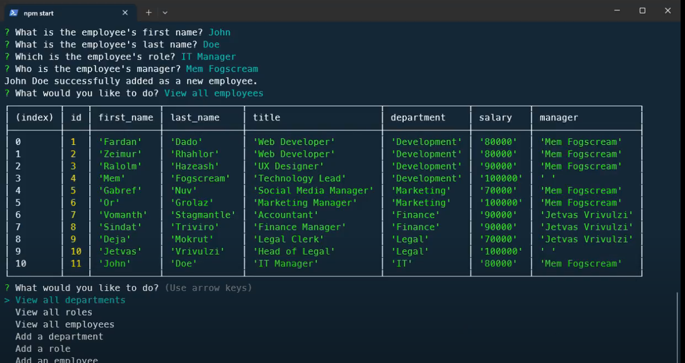

# 12-Challenge-SQL-Employee-Tracker

        
## Description
            
This project is an employee tracker application built using the programming language SQL (Structured Query Language) and run using the [PostgreSQL database system](https://www.postgresql.org/).

I built this application as a way to store, track and update employee data in a database. In a real world example, a fictional company or employer can use the application to keep track of their company data in a safe and reliable way, reducing the risk of errors if needing to alter employee records or manage payroll. Another benefit of the application is that the person using it doesn't require any experience with Javascript or SQL (only minimal experience to install). 

By completing this project, I expanded my knowledge of SQL queries and how to combine them with Javascript logic in a powerful way. 

### Video walkthrough showing application functionality:

To view a video walkthrough of the application, please watch [a video demonstration here](https://drive.google.com/file/d/1B18A_t_GiyjzOOwG9Y9XMUJJuH0E3UwJ/view?usp=sharing). 

### Screenshot of application showing user input prompts:

The screenshot below shows the application being run in the command line. Specifically, it shows how a new employee, named 'John Doe' has been added to the database in a newly created role. 

            
## Table of Contents
            
- [Installation](#installation)
- [Usage](#usage)
- [License](#license)
- [Contributing](#contributing)
- [Tests](#tests)
- [Questions](#questions)
            
## Installation

To install this application, you'll need to clone the repository to your local machine. [Refer to this guide from GitHub if you need help.](https://docs.github.com/en/repositories/creating-and-managing-repositories/cloning-a-repository/)

Once cloned, you will need to navigate to the project's folder in your terminal and run the command 'npm i' to install the necessary dependencies. 
            
## Usage

To use this application, you will need PostgreSQL installed on your computer. [Visit PostgreSQL's website for links to download and installation instructions.](https://www.postgresql.org/)

Once PostgreSQL is installed on your computer, you will need to initialise the 'employee_db' database and seed data into it. To do so, enter the following commands once navigated to the project folder in your terminal:

1. 'psql -U postgres' - This will start PostgreSQL. Enter your password if you set one up. 
2. '\i main/db/schema.sql' - To set up the 'employee_db' database.
3. '\i main/db/seed.sql' - To seed the 'employee_db' database with some employee information. 

The last step is to run the application by entering:

4. 'npm start'

If everything has worked correctly, you should be greeted by the application's welcome message and see a list of prompts for viewing or adding new employee data.
            
## License
            
MIT License

Copyright (c) 2024 isaacfallon
            
Permission is hereby granted, free of charge, to any person obtaining a copy
of this software and associated documentation files (the "Software"), to deal
in the Software without restriction, including without limitation the rights
to use, copy, modify, merge, publish, distribute, sublicense, and/or sell
copies of the Software, and to permit persons to whom the Software is
furnished to do so, subject to the following conditions:
            
The above copyright notice and this permission notice shall be included in all
copies or substantial portions of the Software.
            
THE SOFTWARE IS PROVIDED "AS IS", WITHOUT WARRANTY OF ANY KIND, EXPRESS OR
IMPLIED, INCLUDING BUT NOT LIMITED TO THE WARRANTIES OF MERCHANTABILITY,
FITNESS FOR A PARTICULAR PURPOSE AND NONINFRINGEMENT. IN NO EVENT SHALL THE
AUTHORS OR COPYRIGHT HOLDERS BE LIABLE FOR ANY CLAIM, DAMAGES OR OTHER
LIABILITY, WHETHER IN AN ACTION OF CONTRACT, TORT OR OTHERWISE, ARISING FROM,
OUT OF OR IN CONNECTION WITH THE SOFTWARE OR THE USE OR OTHER DEALINGS IN THE
SOFTWARE.
            
## Contributing

1. The employee names that are used to seed the database were generated using the following website: https://www.fantasynamegenerators.com/dnd-human-names.php

2. To understand how to achieve multiple 'JOINS' in one SQL Query, I referenced the following answer from 'Code Magician' on this StackOverflow answer: https://stackoverflow.com/questions/8974328/mysql-multiple-joins-in-one-query

3. To convert my SQL table data into arrays, I referenced the following answer from 'Gordon Linoff' on this StackOverflow answer: https://stackoverflow.com/questions/66464881/convert-sql-data-in-columns-into-an-array

            
## Tests

N/A
     
## Questions
            
If you have any questions, please reach out at either of the following:
            
### GitHub profile:
- https://github.com/isaacfallon

### Email:
- isaac.fallon@gmail.com
